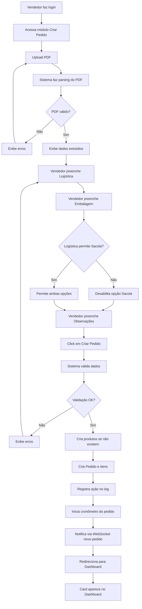
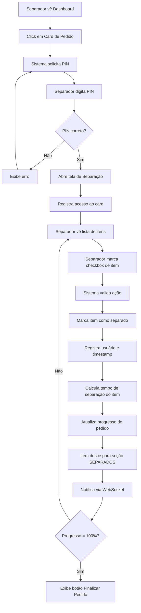
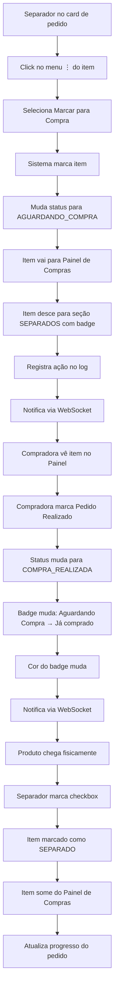
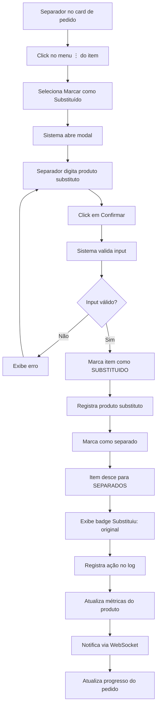
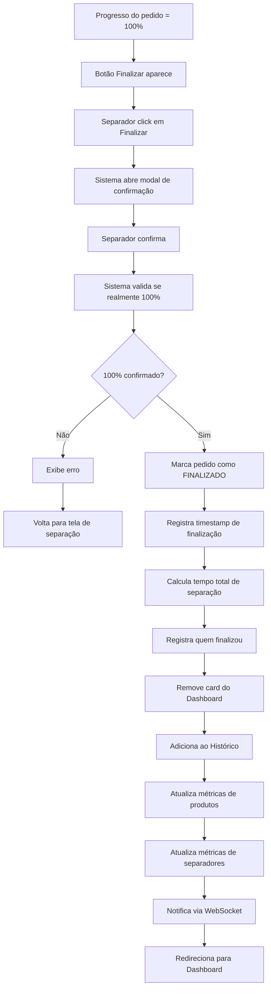

# Projeto: Web App de Separação de Pedidos - PMCELL

## 📋 ÍNDICE
1. [Visão Geral](#1-visão-geral)
2. [Informações Coletadas](#2-informações-coletadas)
3. [Stack Técnica e Infraestrutura](#3-stack-técnica-e-infraestrutura)
4. [Arquitetura do Sistema](#4-arquitetura-do-sistema)
5. [Autenticação e Segurança](#5-autenticação-e-segurança)
6. [Módulos e Funcionalidades](#6-módulos-e-funcionalidades)
7. [Modelo de Dados (DDD)](#7-modelo-de-dados-ddd)
8. [Fluxos de Trabalho](#8-fluxos-de-trabalho)
9. [Requisitos de UI/UX](#9-requisitos-de-uiux)
10. [Métricas e Indicadores](#10-métricas-e-indicadores)
11. [Regras de Negócio](#11-regras-de-negócio)
12. [Especificações Técnicas](#12-especificações-técnicas)

---

## 1. VISÃO GERAL

### 1.1 Objetivo
Desenvolver um web app interno para otimização do processo de separação de pedidos da PMCELL São Paulo, permitindo:
- Upload e parsing automático de orçamentos em PDF
- Gestão de tarefas de separação via sistema de cards
- Controle de produtos faltantes (integração com compras)
- Medição de performance da equipe em tempo real

### 1.2 Escopo
- **Usuários**: 7-12 funcionários simultâneos
- **Volume**: 30-40 pedidos/dia
- **Tipos de usuário**: Vendedores, Separadores, Compradora, Administrador
- **Acesso**: Web app interno (não público)

### 1.3 Metodologia
- **Planejamento**: Atômico (fases pequenas e incrementais)
- **Arquitetura**: Domain-Driven Design (DDD) rigoroso
- **Desenvolvimento**: TDD (Test-Driven Development)

---

## 2. INFORMAÇÕES COLETADAS

### 2.1 Estrutura dos PDFs (Análise Realizada)
✅ **Arquivo de referência**: `modelo-pdf.md`

**Campos extraídos do PDF:**
- Número do Orçamento (5 dígitos)
- Código do Cliente (6 dígitos)
- Nome do Cliente
- Nome do Vendedor
- Data do Orçamento
- Lista de Produtos:
  - Código do Produto (5 dígitos - ID único)
  - Descrição do Produto
  - Quantidade
  - Valor Unitário
  - Valor Total
- Valor Total do Orçamento
- Desconto
- Valor a Pagar

**Validação Matemática:**
```
Quantidade × Valor Unitário = Valor Total (para cada produto)
Soma(Valores Totais) - Desconto = Valor a Pagar
```

### 2.2 Respostas do Questionário

| Pergunta | Resposta |
|----------|----------|
| **PDFs padronizados?** | Sim, estrutura consistente. Parsing com validação matemática. |
| **Autenticação** | Login numérico + PIN 4 dígitos. Mesmo login para todas as ações. |
| **Finalização de pedido** | 100% separado → Botão "Finalizar" → Card vai para Histórico |
| **Produto em compra** | Checkbox simples quando chegar. Sem marcação de "chegada". |
| **Múltiplos separadores** | Sim, sem restrição. Sistema registra quem/quando marcou cada item. |
| **Cadastro de produtos** | Não. Produtos criados do PDF. ID único para métricas. |
| **Logística/Embalagem** | Exibir nos cards. Validação: Correios/Melhor Envio/Ônibus = só Caixa. |
| **Painel de Compras** | Checkbox item por item. Agrupado por pedido. Badge muda de cor. |
| **Exportar relatórios** | Não. Apenas visualização na tela. |
| **Volume/Performance** | 30-40 pedidos/dia. 7-12 usuários. Sem SLA (vai medir). |

---

## 3. STACK TÉCNICA E INFRAESTRUTURA

### 3.1 Backend
- **Framework**: Django 5.x
- **Tempo Real**: Django Channels (WebSockets)
- **Banco de Dados**: PostgreSQL 15+
- **Parsing PDF**: pdfplumber ou PyMuPDF
- **Cache**: Redis (para WebSockets e sessões)
- **API**: Django REST Framework (para endpoints assíncronos)

### 3.2 Frontend
- **Framework**: Django Templates + HTMX (para reatividade)
- **Alternativa moderna**: Vue.js 3 ou React 18 (se preferir SPA)
- **CSS Framework**: Tailwind CSS 3.x
- **Animações**: Framer Motion ou Tailwind transitions
- **WebSocket Client**: Socket.io-client ou native WebSocket API

### 3.3 Hospedagem (Econômica)
**Opções recomendadas:**

#### Opção 1: Railway.app (Recomendado)
- Django + PostgreSQL + Redis
- ~$10-20/mês
- Suporta Django Channels
- Deploy automático via Git

#### Opção 2: Render.com
- PostgreSQL gratuito (limite 1GB)
- Web service: $7/mês
- Redis: $10/mês
- Total: ~$17/mês

#### Opção 3: PythonAnywhere
- ~$10/mês (plano Hacker)
- **Limitação**: Não suporta WebSockets nativamente
- Requer polling para tempo real

**Escolha recomendada**: Railway.app (melhor custo-benefício + suporte completo)

### 3.4 Ferramentas de Desenvolvimento
- **Versionamento**: Git + GitHub/GitLab
- **CI/CD**: GitHub Actions
- **Testes**: pytest, pytest-django, Playwright (E2E)
- **Qualidade de Código**: Black, Flake8, MyPy
- **Documentação**: Swagger/OpenAPI (para APIs)

---

## 4. ARQUITETURA DO SISTEMA

### 4.1 Estrutura DDD (Domain-Driven Design)

```
separacao-pmcell/
├── src/
│   ├── domain/                    # Camada de Domínio
│   │   ├── pedido/
│   │   │   ├── entities.py        # Pedido, ItemPedido
│   │   │   ├── value_objects.py   # Logistica, Embalagem, Status
│   │   │   ├── repositories.py    # Interface de repositórios
│   │   │   └── services.py        # Lógica de negócio
│   │   ├── produto/
│   │   │   ├── entities.py        # Produto
│   │   │   └── services.py        # Métricas de produto
│   │   ├── usuario/
│   │   │   ├── entities.py        # Usuario
│   │   │   └── services.py        # Autenticação
│   │   └── compra/
│   │       ├── entities.py        # ItemCompra
│   │       └── services.py        # Gestão de compras
│   │
│   ├── application/               # Camada de Aplicação
│   │   ├── use_cases/
│   │   │   ├── criar_pedido.py
│   │   │   ├── separar_item.py
│   │   │   ├── finalizar_pedido.py
│   │   │   ├── enviar_para_compra.py
│   │   │   └── substituir_item.py
│   │   └── dto/                   # Data Transfer Objects
│   │
│   ├── infrastructure/            # Camada de Infraestrutura
│   │   ├── persistence/
│   │   │   ├── models.py          # Django Models
│   │   │   └── repositories.py    # Implementação dos repositórios
│   │   ├── pdf/
│   │   │   ├── parser.py          # Parsing de PDF
│   │   │   └── validator.py       # Validação matemática
│   │   ├── websocket/
│   │   │   └── consumers.py       # Django Channels consumers
│   │   └── cache/
│   │       └── redis_client.py
│   │
│   ├── presentation/              # Camada de Apresentação
│   │   ├── web/
│   │   │   ├── views.py
│   │   │   ├── templates/
│   │   │   ├── static/
│   │   │   └── forms.py
│   │   └── api/
│   │       └── serializers.py
│   │
│   └── config/                    # Configurações
│       ├── settings.py
│       ├── urls.py
│       └── wsgi.py / asgi.py
│
├── tests/                         # Testes
│   ├── unit/
│   ├── integration/
│   └── e2e/
│
├── docs/                          # Documentação
│   ├── modelo-pdf.md              # Já criado
│   └── projeto.md                 # Este arquivo
│
├── requirements.txt
├── docker-compose.yml
└── README.md
```

### 4.2 Bounded Contexts (DDD)

#### Context 1: Gestão de Pedidos
- Criação de pedidos (upload PDF)
- Separação de itens
- Finalização de pedidos
- Histórico

#### Context 2: Gestão de Compras
- Controle de itens faltantes
- Marcação de pedidos realizados
- Status de itens em compra

#### Context 3: Gestão de Usuários
- Autenticação
- Rastreabilidade de ações
- Gestão administrativa

#### Context 4: Métricas e Indicadores
- Tempo de separação
- Rankings de produtos
- Performance de separadores

---

## 5. AUTENTICAÇÃO E SEGURANÇA

### 5.1 Sistema de Login

**Credenciais:**
- **Login**: Número (1-100)
- **Senha**: PIN de 4 dígitos (0000-9999)

**Fluxo de Autenticação:**
1. Usuário acessa o webapp
2. Tela de login: campo numérico + campo PIN
3. Sistema valida credenciais
4. Sessão criada com timeout de 8 horas
5. Todas as ações registram o usuário logado

**Uso das Credenciais:**
- ✅ Login inicial no sistema
- ✅ Upload de PDF (registra vendedor)
- ✅ Acesso a card de separação (registra separador)
- ✅ Marcação de itens (registra quem/quando)
- ✅ Ações no painel de compras

### 5.2 Rastreabilidade

**Registro de Ações:**
```python
class AcaoLog:
    usuario_id: int
    tipo_acao: str  # "separar_item", "finalizar_pedido", etc.
    pedido_id: int
    item_id: int (opcional)
    timestamp: datetime
    dados_adicionais: dict
```

**Exibição:**
- **No card (detalhe)**: Mostrar nome do usuário que separou cada item
- **No dashboard**: Mostrar quem está separando o pedido naquele momento
- **No histórico**: Dados completos (quem, quando, tempo)

### 5.3 Segurança

**Medidas:**
- Hashing de senhas (mesmo sendo PIN): PBKDF2
- CSRF protection (Django nativo)
- Rate limiting: máx 5 tentativas de login/minuto
- Session timeout: 8 horas de inatividade
- HTTPS obrigatório em produção
- Não expor webapp publicamente (apenas rede interna ou VPN)

---

## 6. MÓDULOS E FUNCIONALIDADES

### 6.1 Módulo: Criação de Pedido (Vendedor)

**Tela:** Upload de Orçamento

**Campos:**
1. **Upload de PDF** (obrigatório)
   - Aceita apenas .pdf
   - Tamanho máximo: 10MB
   - Preview do arquivo após upload

2. **Dados Extraídos Automaticamente** (exibir para confirmação)
   - Número do Orçamento
   - Nome do Cliente
   - Vendedor (do PDF)
   - Lista de Produtos
   - Valor Total

3. **Campos Manuais** (preenchidos pelo vendedor)
   - **Logística** (dropdown):
     - Correios
     - Lalamove
     - Melhor Envio
     - Retirada
     - Ônibus
     - Cliente na Loja

   - **Embalagem** (radio buttons):
     - Caixa
     - Sacola
     - **Regra**: Se Logística = Correios, Melhor Envio ou Ônibus → desabilitar Sacola

   - **Observações** (textarea, opcional)
     - Limite: 500 caracteres

**Ação:**
- Botão "Criar Pedido"
- Sistema valida dados
- Cria card no Dashboard de Separação
- Inicia cronômetro do pedido
- Redireciona para Dashboard

**Validações:**
- PDF válido e parseável
- Todos os campos obrigatórios preenchidos
- Validação matemática dos produtos (quantidade × valor = total)
- Regra de embalagem respeitada

---

### 6.2 Módulo: Dashboard de Separação (Tela Principal)

**Layout:**

```
┌────────────────────────────────────────────────────────────┐
│  🏠 PMCELL - Separação de Pedidos          👤 User: João   │
├────────────────────────────────────────────────────────────┤
│                                                            │
│  ⏱️ TEMPO MÉDIO DE SEPARAÇÃO                               │
│     ┌──────────────────────────────────────┐              │
│     │         45 minutos                    │  (Hoje)      │
│     │    (52 min - últimos 7 dias)          │              │
│     └──────────────────────────────────────┘              │
│                                                            │
│  📦 PEDIDOS EM SEPARAÇÃO (12)              🔍 [Buscar]     │
│                                                            │
│  ┌──────────────────────────────────────────────────────┐ │
│  │ 📋 #30567 - Rosana                   ⏱️ 12min         │ │
│  │ 👤 Vendedor: Nycolas                                  │ │
│  │ 📦 Logística: Correios | 📦 Caixa                     │ │
│  │ ✅ Progresso: 0/1 itens                               │ │
│  │ 👷 Separando: João                                     │ │
│  └──────────────────────────────────────────────────────┘ │
│                                                            │
│  ┌──────────────────────────────────────────────────────┐ │
│  │ 📋 #30568 - Ponto do Celular         ⏱️ 8min          │ │
│  │ 👤 Vendedor: Nycolas                                  │ │
│  │ 📦 Logística: Lalamove | 📦 Sacola                    │ │
│  │ ✅ Progresso: 3/11 itens                              │ │
│  │ 👷 Separando: Maria, Pedro                            │ │
│  └──────────────────────────────────────────────────────┘ │
│                                                            │
│  [Mais cards...]                                          │
│                                                            │
│  ← Anterior | Página 1/2 | Próximo →                     │
└────────────────────────────────────────────────────────────┘
```

**Características:**
- Cards ordenados por tempo de separação (mais antigos primeiro)
- Atualização em tempo real (WebSocket)
- Cada card mostra:
  - Número do orçamento
  - Nome do cliente
  - Vendedor
  - Logística e Embalagem
  - Progresso (X/Y itens)
  - Cronômetro (tempo decorrido)
  - Quem está separando agora
- Click no card → Abre tela de Separação de Pedido

**Filtros/Busca (opcional):**
- Buscar por número de orçamento
- Buscar por cliente
- Filtrar por vendedor

---

### 6.3 Módulo: Separação de Pedido (Detalhe do Card)

**Fluxo de Acesso:**
1. Usuário clica em um card no dashboard
2. Sistema solicita senha (autenticação)
3. Campo: "Digite sua senha de 4 dígitos"
4. Valida senha
5. Abre tela de separação

**Layout da Tela:**

```
┌────────────────────────────────────────────────────────────┐
│  ← Voltar ao Dashboard                                     │
├────────────────────────────────────────────────────────────┤
│  📋 PEDIDO #30568 - Ponto do Celular     ⏱️ 15min 32s      │
│  👤 Vendedor: Nycolas                                      │
│  📦 Logística: Lalamove  |  📦 Embalagem: Sacola           │
│  💬 Obs: Entregar antes das 18h                            │
│                                                            │
│  ✅ Progresso: 5/11 itens (45%)                            │
│  ━━━━━━━━━━━━━━━━━━━━━━━━━━━━━━━━━━━━━━━━━━━━━━━━━━━━━━  │
│                                                            │
│  📦 PRODUTOS:                                              │
│                                                            │
│  ┌──────────────────────────────────────────────────────┐ │
│  │ ☐ CB14 - CABO PMCELL P2XP2 C                         │ │
│  │    Qtd: 10 | Valor: R$ 1,40 | Total: R$ 14,00        │ │
│  │                                           [⋮ Opções]  │ │
│  └──────────────────────────────────────────────────────┘ │
│                                                            │
│  ┌──────────────────────────────────────────────────────┐ │
│  │ ☐ CB15 - CABO FLAT PMCELL IP                         │ │
│  │    Qtd: 10 | Valor: R$ 4,50 | Total: R$ 45,00        │ │
│  │                                           [⋮ Opções]  │ │
│  └──────────────────────────────────────────────────────┘ │
│                                                            │
│  [Mais produtos...]                                        │
│                                                            │
│  ─────────── SEPARADOS ───────────                        │
│                                                            │
│  ┌──────────────────────────────────────────────────────┐ │
│  │ ✅ CB26 - CABO PMCELL LIGHTNING                       │ │
│  │    Qtd: 10 | Valor: R$ 6,50 | Total: R$ 65,00        │ │
│  │    👤 Separado por: João às 14:32                     │ │
│  └──────────────────────────────────────────────────────┘ │
│                                                            │
│  ┌──────────────────────────────────────────────────────┐ │
│  │ ✅ SP42 - SUPORTE VEICULAR WIRELESS                   │ │
│  │    Qtd: 10 | Valor: R$ 22,50 | Total: R$ 225,00      │ │
│  │    👤 Separado por: Maria às 14:28                    │ │
│  │    🔄 Substituiu: SP40 - SUPORTE VEICULAR BÁSICO      │ │
│  └──────────────────────────────────────────────────────┘ │
│                                                            │
│  ┌──────────────────────────────────────────────────────┐ │
│  │ 🛒 CJ-37 - SUPORTE PARA MOTO HMASTON                  │ │
│  │    Qtd: 5 | Valor: R$ 20,00 | Total: R$ 100,00       │ │
│  │    📦 Status: Já comprado                             │ │
│  │    👤 Enviado por: Pedro às 13:45                     │ │
│  └──────────────────────────────────────────────────────┘ │
│                                                            │
│                   [🎯 FINALIZAR PEDIDO]   (aparece ao 100%)│
└────────────────────────────────────────────────────────────┘
```

**Funcionalidades:**

#### 6.3.1 Checkbox de Item
- Click no checkbox → Item é marcado como separado
- **Animação**: Item "desce" para a seção "SEPARADOS"
- Contador de progresso atualiza em tempo real
- Registra: usuário + timestamp

#### 6.3.2 Menu de Opções [⋮]
Ao clicar no menu de um item:

**Opção 1: Marcar para Compra**
- Item é enviado para Painel de Compras
- Item "desce" para seção "SEPARADOS" com badge "📦 Aguardando Compra"
- Status: cor diferenciada (ex: laranja)
- Registra: quem enviou + timestamp

**Quando Compradora marca "Pedido Realizado":**
- Badge muda: "📦 Aguardando Compra" → "📦 Já comprado"
- Cor muda (ex: laranja → azul)
- Checkbox continua desmarcado
- Separador pode marcar checkbox quando produto chegar

**Opção 2: Marcar como Substituído**
- Abre modal/dialog
- Campo de texto: "Digite o produto substituto"
- Botão "Confirmar"
- Item original é marcado como separado
- Item vai para seção "SEPARADOS" com badge "🔄 Substituiu: [Nome Original]"
- Cor diferenciada (ex: verde claro)
- Registra: quem substituiu + produto substituto + timestamp

#### 6.3.3 Botão Finalizar Pedido
**Condição de aparecimento:**
```
(Itens Separados + Itens Substituídos) / Total de Itens = 100%
```

**Ação:**
- Click → Modal de confirmação: "Finalizar pedido #30568?"
- Confirmar → Card sai do Dashboard
- Card vai para tela de Histórico
- Registra: quem finalizou + timestamp de finalização
- Calcula tempo total de separação do pedido

**Atualização em Tempo Real:**
- Quando outro separador marca um item → checkbox atualiza instantaneamente
- Progresso atualiza para todos os usuários visualizando o card
- Lista de "quem está separando" atualiza em tempo real

---

### 6.4 Módulo: Painel de Compras

**Acesso:** Menu lateral ou top nav → "Compras"

**Layout:**

```
┌────────────────────────────────────────────────────────────┐
│  🛒 PAINEL DE COMPRAS                                      │
├────────────────────────────────────────────────────────────┤
│  📋 PEDIDOS COM ITENS FALTANTES (3 pedidos, 8 itens)       │
│                                                            │
│  ┌──────────────────────────────────────────────────────┐ │
│  │ 📋 PEDIDO #30568 - Ponto do Celular   ⏱️ 1h 15min     │ │
│  │ 👤 Vendedor: Nycolas                                  │ │
│  │ 📦 Logística: Lalamove  | 💬 Obs: Urgente             │ │
│  │                                                       │ │
│  │ Produto                        Qtd   Preço   Pedido   │ │
│  │ ────────────────────────────────────────────────────  │ │
│  │ ☐ CJ-37 SUPORTE MOTO HMASTON    5   R$ 20,00   ☐     │ │
│  │ ☐ SP42 SUPORTE VEICULAR         3   R$ 22,50   ☐     │ │
│  └──────────────────────────────────────────────────────┘ │
│                                                            │
│  ┌──────────────────────────────────────────────────────┐ │
│  │ 📋 PEDIDO #30570 - Infocel        ⏱️ 45min            │ │
│  │ 👤 Vendedor: Lucas                                    │ │
│  │ 📦 Logística: Correios  | 💬 Obs: -                   │ │
│  │                                                       │ │
│  │ Produto                        Qtd   Preço   Pedido   │ │
│  │ ────────────────────────────────────────────────────  │ │
│  │ ☑ PELICULA 3D SAM A35          15   R$ 1,20    ✅     │ │
│  │ ☐ CABO PMCELL TIPO C           10   R$ 6,50    ☐     │ │
│  └──────────────────────────────────────────────────────┘ │
│                                                            │
└────────────────────────────────────────────────────────────┘
```

**Características:**
- **Agrupamento**: Por pedido
- **Ordenação**: Por tempo de separação (mais antigos primeiro)
- **Info do pedido**: Cliente, Vendedor, Tempo, Logística, Observações

**Tabela de Produtos:**
- Colunas:
  1. Nome do Produto
  2. Quantidade
  3. Preço (do PDF - teto para compra)
  4. Checkbox "Pedido Realizado"

- Produtos ordenados alfabeticamente dentro de cada pedido

**Ação do Checkbox:**
- Compradora marca "Pedido Realizado"
- Sistema atualiza status do item no card de separação:
  - Badge: "Aguardando Compra" → "Já comprado"
  - Cor: laranja → azul
- Item permanece na lista até ser efetivamente separado
- Atualização em tempo real (WebSocket)

**Integração com Separação:**
- Quando separador marca checkbox do item "Já comprado"
- Item é marcado como separado normalmente
- Item some da lista de Compras

---

### 6.5 Módulo: Histórico de Pedidos

**Acesso:** Menu → "Histórico"

**Layout:**

```
┌────────────────────────────────────────────────────────────┐
│  📊 HISTÓRICO DE PEDIDOS                                   │
├────────────────────────────────────────────────────────────┤
│  🔍 Buscar: [____________]  📅 Período: [Últimos 30 dias ▼]│
│                                                            │
│  Exibindo 156 pedidos finalizados                          │
│                                                            │
│  ┌──────────────────────────────────────────────────────┐ │
│  │ 📋 #30567 - Rosana                                    │ │
│  │ ✅ Finalizado em: 22/10/25 às 15:32                   │ │
│  │ ⏱️ Tempo total: 28 minutos                            │ │
│  │ 👤 Vendedor: Nycolas | Separador: João                │ │
│  │ 📦 Logística: Correios | Embalagem: Caixa             │ │
│  │                                         [Ver Detalhes] │ │
│  └──────────────────────────────────────────────────────┘ │
│                                                            │
│  ┌──────────────────────────────────────────────────────┐ │
│  │ 📋 #30566 - Cliente Atacado                           │ │
│  │ ✅ Finalizado em: 22/10/25 às 14:18                   │ │
│  │ ⏱️ Tempo total: 1h 12min                              │ │
│  │ 👤 Vendedor: Lucas | Separadores: Maria, Pedro        │ │
│  │ 📦 Logística: Lalamove | Embalagem: Sacola            │ │
│  │                                         [Ver Detalhes] │ │
│  └──────────────────────────────────────────────────────┘ │
│                                                            │
│  [Mais pedidos...]                                         │
│                                                            │
│  ← Anterior | Página 1/8 | Próximo →                     │
└────────────────────────────────────────────────────────────┘
```

**Click em "Ver Detalhes":**
Abre modal/página com:
- Todos os produtos do pedido
- Para cada produto:
  - Código, Nome, Quantidade, Valor
  - Quem separou
  - Horário de separação
  - Se foi substituído: produto substituto
  - Tempo individual de separação
- Timeline do pedido:
  - Criado por [usuário] às [hora]
  - Item X separado por [usuário] às [hora]
  - Item Y enviado para compra por [usuário] às [hora]
  - Item Y comprado às [hora]
  - Item Y separado por [usuário] às [hora]
  - Finalizado por [usuário] às [hora]

**Filtros:**
- Por data (range)
- Por vendedor
- Por cliente
- Por status (todos, com substituição, com compra)

---

### 6.6 Módulo: Painel Administrativo

**Acesso:** Apenas usuários com flag `is_admin = True`

**Seções:**

#### 6.6.1 Identidade Visual
```
┌────────────────────────────────────────────────┐
│  🎨 IDENTIDADE VISUAL                          │
├────────────────────────────────────────────────┤
│  Logo da Empresa:                              │
│  ┌────────────┐                                │
│  │ [Logo]     │  📤 Upload Nova Logo            │
│  └────────────┘  🗑️ Remover Logo                │
│                                                │
│  Favicon:                                      │
│  🔲 [favicon]    📤 Upload Favicon              │
│                  🗑️ Remover Favicon             │
└────────────────────────────────────────────────┘
```

#### 6.6.2 Gestão de Usuários
```
┌────────────────────────────────────────────────────────────┐
│  👥 GESTÃO DE USUÁRIOS (7/10)                              │
├────────────────────────────────────────────────────────────┤
│  [➕ Adicionar Usuário]                                     │
│                                                            │
│  ┌──────────────────────────────────────────────────────┐ │
│  │ 👤 João Silva                                         │ │
│  │ 📸 [Foto]                                             │ │
│  │ 🔢 Login: 1  |  🔒 PIN: ••••                          │ │
│  │ 💼 Função: Separador                                  │ │
│  │                      [✏️ Editar] [🗑️ Remover]         │ │
│  └──────────────────────────────────────────────────────┘ │
│                                                            │
│  ┌──────────────────────────────────────────────────────┐ │
│  │ 👤 Maria Santos                                       │ │
│  │ 📸 [Foto]                                             │ │
│  │ 🔢 Login: 2  |  🔒 PIN: ••••                          │ │
│  │ 💼 Função: Vendedora                                  │ │
│  │                      [✏️ Editar] [🗑️ Remover]         │ │
│  └──────────────────────────────────────────────────────┘ │
│                                                            │
│  [Mais usuários...]                                        │
└────────────────────────────────────────────────────────────┘
```

**Formulário de Adicionar/Editar Usuário:**
- Nome (obrigatório, max 100 chars)
- Foto (upload, opcional, max 2MB)
- Função (texto livre, ex: "Separador", "Vendedor", "Compras") - apenas para registro
- Login (número de 1-100, único)
- Senha (4 dígitos, 0000-9999)
- Admin? (checkbox)

**Validações:**
- Máximo 10 usuários
- Login único
- Não permitir remover usuário que tem ações registradas (apenas desativar)

---

### 6.7 Módulo: Indicadores (Dashboard de Métricas)

**Acesso:** Menu → "Indicadores"

**Layout:**

```
┌────────────────────────────────────────────────────────────┐
│  📊 INDICADORES DE PERFORMANCE                             │
├────────────────────────────────────────────────────────────┤
│  📅 Período: [Últimos 7 dias ▼]  [01/10/25] até [07/10/25] │
│                                                            │
│  ⏱️ TEMPOS MÉDIOS                                          │
│  ┌────────────────────────┬────────────────────────────┐  │
│  │  Tempo médio por pedido │  Tempo médio por item     │  │
│  │         52 min          │        3,5 min            │  │
│  └────────────────────────┴────────────────────────────┘  │
│                                                            │
│  📦 PRODUTOS - RANKINGS                                    │
│                                                            │
│  ┌──────────────────────────────────────────────────────┐ │
│  │  🐌 PRODUTOS QUE MAIS FICAM EM SEPARAÇÃO              │ │
│  │  1. PACK HIDROGEL FOSCA PRIVATIVA 8" - 45min         │ │
│  │  2. BRINQUEDO DE MONTAR - 22min                      │ │
│  │  3. SUPORTE VEICULAR WIRELESS - 8min                 │ │
│  │  4. PELICULA TABLET REDMI PAD SE 11" - 7min          │ │
│  │  5. CABO PMCELL 66W TC - 5min                        │ │
│  └──────────────────────────────────────────────────────┘ │
│                                                            │
│  ┌──────────────────────────────────────────────────────┐ │
│  │  🛒 PRODUTOS MAIS ENVIADOS PARA COMPRAS               │ │
│  │  1. CABO PMCELL LIGHTNING - 12 vezes                 │ │
│  │  2. PELICULA 3D SAM A16 - 8 vezes                    │ │
│  │  3. TPU SAMSUNG A32 4G - 5 vezes                     │ │
│  │  4. SUPORTE PARA MOTO HMASTON - 3 vezes              │ │
│  │  5. CABO FLAT PMCELL TYPE C - 2 vezes                │ │
│  └──────────────────────────────────────────────────────┘ │
│                                                            │
│  ┌──────────────────────────────────────────────────────┐ │
│  │  🔄 PRODUTOS MAIS SUBSTITUÍDOS                        │ │
│  │  1. FO11 FONE PMCELL - 15 vezes                      │ │
│  │  2. CB14 CABO PMCELL P2XP2 C - 10 vezes              │ │
│  │  3. SP42 SUPORTE VEICULAR WIRELESS - 7 vezes         │ │
│  └──────────────────────────────────────────────────────┘ │
│                                                            │
│  ┌──────────────────────────────────────────────────────┐ │
│  │  ⭐ PRODUTOS QUE MAIS SUBSTITUEM OUTROS               │ │
│  │  1. FO12 FONE PMCELL PLUS - 12 vezes                 │ │
│  │  2. CB15 CABO FLAT PMCELL IP - 8 vezes               │ │
│  │  3. SP45 SUPORTE VEICULAR PRO - 6 vezes              │ │
│  └──────────────────────────────────────────────────────┘ │
│                                                            │
│  👥 SEPARADORES - RANKINGS                                 │
│                                                            │
│  ┌──────────────────────────┬────────────────────────────┐│
│  │ 🏆 POR PEDIDOS FECHADOS  │ 📦 POR ITENS SEPARADOS     ││
│  │ 1. João - 45 pedidos     │ 1. Maria - 523 itens       ││
│  │ 2. Maria - 38 pedidos    │ 2. João - 487 itens        ││
│  │ 3. Pedro - 32 pedidos    │ 3. Pedro - 412 itens       ││
│  │ 4. Ana - 28 pedidos      │ 4. Ana - 356 itens         ││
│  └──────────────────────────┴────────────────────────────┘│
│                                                            │
└────────────────────────────────────────────────────────────┘
```

**Filtros:**
- Período customizado (data início/fim)
- Períodos pré-definidos:
  - Hoje
  - Últimos 7 dias
  - Últimos 30 dias
  - Este mês
  - Mês passado

**Cálculos:**

**Tempo médio por pedido:**
```python
soma(tempo_total_de_cada_pedido) / quantidade_de_pedidos
```

**Tempo médio por item:**
```python
soma(tempo_de_separacao_de_cada_item) / quantidade_de_itens
```

**Produtos que mais ficam em separação:**
```python
# Para cada produto_id único
tempo_medio_produto = soma(tempo_separacao_item) / quantidade_de_vezes_separado
# Ordenar do maior para o menor
```

**Produtos mais enviados para compras:**
```python
# Contar quantas vezes cada produto_id foi marcado "para compra"
# Ordenar do maior para o menor
```

**Produtos mais substituídos:**
```python
# Contar quantas vezes cada produto_id foi substituído
# Ordenar do maior para o menor
```

**Produtos que mais substituem:**
```python
# Contar quantas vezes cada produto_substituto foi usado
# Ordenar do maior para o menor
```

**Rankings de separadores:**
- **Por pedidos fechados**: contar quantos pedidos cada usuário finalizou
- **Por itens separados**: contar quantos itens cada usuário marcou como separado

---

## 7. MODELO DE DADOS (DDD)

### 7.1 Entidades do Domínio

#### 7.1.1 Usuario (Aggregate Root)
```python
class Usuario:
    id: int
    login: int (1-100, único)
    senha_hash: str
    nome: str
    foto_url: str (opcional)
    funcao: str (ex: "Separador", "Vendedor")
    is_admin: bool
    ativo: bool
    criado_em: datetime
    atualizado_em: datetime
```

#### 7.1.2 Pedido (Aggregate Root)
```python
class Pedido:
    id: int
    numero_orcamento: str (5 dígitos, único)

    # Dados do cliente
    codigo_cliente: str (6 dígitos)
    nome_cliente: str

    # Dados do vendedor
    vendedor_id: int (FK Usuario)
    vendedor_nome_pdf: str (do PDF, pode diferir do cadastro)

    # Dados do pedido
    data_orcamento: date
    data_criacao: datetime
    data_finalizacao: datetime (nullable)

    # Logística
    logistica: LogisticaEnum
    embalagem: EmbalagemEnum
    observacoes: str (opcional)

    # Valores
    valor_total_pdf: Decimal
    desconto_pdf: Decimal
    valor_a_pagar_pdf: Decimal

    # Status e métricas
    status: StatusPedidoEnum
    progresso_percentual: float (calculado)
    tempo_total_segundos: int (calculado)

    # Arquivo
    pdf_url: str

    # Relacionamentos
    itens: List[ItemPedido]

    # Métodos de domínio
    def calcular_progresso() -> float
    def pode_finalizar() -> bool
    def finalizar(usuario_id: int) -> None
    def tempo_decorrido() -> int
```

**Enums:**
```python
class LogisticaEnum(Enum):
    CORREIOS = "correios"
    LALAMOVE = "lalamove"
    MELHOR_ENVIO = "melhor_envio"
    RETIRADA = "retirada"
    ONIBUS = "onibus"
    CLIENTE_NA_LOJA = "cliente_na_loja"

class EmbalagemEnum(Enum):
    CAIXA = "caixa"
    SACOLA = "sacola"

class StatusPedidoEnum(Enum):
    EM_SEPARACAO = "em_separacao"
    FINALIZADO = "finalizado"
```

#### 7.1.3 ItemPedido (Entity)
```python
class ItemPedido:
    id: int
    pedido_id: int (FK Pedido)

    # Dados do produto
    produto_id: int (FK Produto)
    codigo_produto: str (do PDF)
    descricao_produto: str (do PDF)

    # Valores
    quantidade: int
    valor_unitario: Decimal
    valor_total: Decimal

    # Status
    status: StatusItemEnum

    # Separação
    separado_por_id: int (FK Usuario, nullable)
    separado_em: datetime (nullable)
    tempo_separacao_segundos: int (nullable)

    # Substituição
    produto_substituto_id: int (FK Produto, nullable)
    produto_substituto_descricao: str (nullable)
    substituido_por_id: int (FK Usuario, nullable)
    substituido_em: datetime (nullable)

    # Compra
    enviado_para_compra_por_id: int (FK Usuario, nullable)
    enviado_para_compra_em: datetime (nullable)
    compra_realizada: bool
    compra_realizada_em: datetime (nullable)

    # Métodos de domínio
    def marcar_como_separado(usuario_id: int) -> None
    def enviar_para_compra(usuario_id: int) -> None
    def marcar_compra_realizada() -> None
    def substituir(usuario_id: int, produto_substituto: str) -> None
```

**Enum:**
```python
class StatusItemEnum(Enum):
    PENDENTE = "pendente"
    SEPARADO = "separado"
    AGUARDANDO_COMPRA = "aguardando_compra"
    COMPRA_REALIZADA = "compra_realizada"
    SUBSTITUIDO = "substituido"
```

#### 7.1.4 Produto (Aggregate Root)
```python
class Produto:
    id: int
    codigo: str (5 dígitos, único)
    descricao: str

    # Métricas agregadas (calculadas)
    total_separacoes: int
    tempo_medio_separacao_segundos: int
    total_enviado_compras: int
    total_substituicoes: int
    total_como_substituto: int

    criado_em: datetime
    atualizado_em: datetime

    # Métodos de domínio
    def atualizar_metricas() -> None
```

#### 7.1.5 AcaoLog (Entity)
```python
class AcaoLog:
    id: int
    usuario_id: int (FK Usuario)
    tipo_acao: TipoAcaoEnum

    pedido_id: int (FK Pedido, nullable)
    item_id: int (FK ItemPedido, nullable)

    timestamp: datetime
    dados_adicionais: dict (JSONField)

    # Ex de dados_adicionais:
    # {
    #   "produto_substituto": "CB15 CABO FLAT",
    #   "ip_address": "192.168.1.10",
    #   "tempo_decorrido": 120
    # }
```

**Enum:**
```python
class TipoAcaoEnum(Enum):
    LOGIN = "login"
    CRIAR_PEDIDO = "criar_pedido"
    ACESSAR_CARD = "acessar_card"
    SEPARAR_ITEM = "separar_item"
    ENVIAR_PARA_COMPRA = "enviar_para_compra"
    MARCAR_COMPRA_REALIZADA = "marcar_compra_realizada"
    SUBSTITUIR_ITEM = "substituir_item"
    FINALIZAR_PEDIDO = "finalizar_pedido"
```

### 7.2 Value Objects

```python
class Logistica(ValueObject):
    tipo: LogisticaEnum

    def permite_sacola(self) -> bool:
        return self.tipo not in [
            LogisticaEnum.CORREIOS,
            LogisticaEnum.MELHOR_ENVIO,
            LogisticaEnum.ONIBUS
        ]

class Embalagem(ValueObject):
    tipo: EmbalagemEnum

class DadosOrcamentoPDF(ValueObject):
    numero_orcamento: str
    codigo_cliente: str
    nome_cliente: str
    vendedor_nome: str
    data_orcamento: date
    valor_total: Decimal
    desconto: Decimal
    valor_a_pagar: Decimal
    itens: List[ItemOrcamentoPDF]

    def validar_matematica(self) -> bool:
        # Valida que soma dos itens - desconto = valor_a_pagar
        pass

class ItemOrcamentoPDF(ValueObject):
    codigo: str
    descricao: str
    quantidade: int
    valor_unitario: Decimal
    valor_total: Decimal

    def validar_matematica(self) -> bool:
        return self.quantidade * self.valor_unitario == self.valor_total
```

### 7.3 Repositories (Interfaces)

```python
class IPedidoRepository(ABC):
    def adicionar(self, pedido: Pedido) -> None
    def obter_por_id(self, id: int) -> Pedido
    def obter_por_numero_orcamento(self, numero: str) -> Pedido
    def listar_em_separacao(self) -> List[Pedido]
    def listar_finalizados(self, filtros: dict) -> List[Pedido]
    def atualizar(self, pedido: Pedido) -> None

class IProdutoRepository(ABC):
    def adicionar(self, produto: Produto) -> None
    def obter_por_codigo(self, codigo: str) -> Produto
    def obter_ou_criar(self, codigo: str, descricao: str) -> Produto
    def listar_ranking_tempo_separacao(self, limite: int) -> List[Produto]
    def listar_ranking_compras(self, limite: int) -> List[Produto]

class IUsuarioRepository(ABC):
    def adicionar(self, usuario: Usuario) -> None
    def obter_por_id(self, id: int) -> Usuario
    def obter_por_login(self, login: int) -> Usuario
    def listar_ativos(self) -> List[Usuario]
    def atualizar(self, usuario: Usuario) -> None
```

### 7.4 Services (Domain Services)

```python
class PedidoService:
    def criar_pedido_de_pdf(
        self,
        pdf_file: File,
        logistica: Logistica,
        embalagem: Embalagem,
        observacoes: str,
        usuario_id: int
    ) -> Pedido:
        # 1. Parse do PDF
        # 2. Validação matemática
        # 3. Criar/obter produtos
        # 4. Criar pedido e itens
        # 5. Registrar ação
        pass

    def calcular_tempo_medio_separacao(
        self,
        data_inicio: date,
        data_fim: date
    ) -> int:
        pass

class ItemPedidoService:
    def separar_item(
        self,
        item_id: int,
        usuario_id: int
    ) -> None:
        # 1. Obter item
        # 2. Marcar como separado
        # 3. Calcular tempo de separação
        # 4. Atualizar progresso do pedido
        # 5. Registrar ação
        # 6. Notificar via WebSocket
        pass

    def enviar_para_compra(
        self,
        item_id: int,
        usuario_id: int
    ) -> None:
        pass

    def substituir_item(
        self,
        item_id: int,
        produto_substituto_descricao: str,
        usuario_id: int
    ) -> None:
        pass

class MetricasService:
    def calcular_ranking_separadores_por_pedidos(
        self,
        data_inicio: date,
        data_fim: date
    ) -> List[dict]:
        pass

    def calcular_ranking_separadores_por_itens(
        self,
        data_inicio: date,
        data_fim: date
    ) -> List[dict]:
        pass
```

---

## 8. FLUXOS DE TRABALHO

### 8.1 Fluxo: Criação de Pedido



### 8.2 Fluxo: Separação de Item



### 8.3 Fluxo: Envio para Compra



### 8.4 Fluxo: Substituição de Item



### 8.5 Fluxo: Finalização de Pedido



---

## 9. REQUISITOS DE UI/UX

### 9.1 Design System

#### 9.1.1 Paleta de Cores (Sugestão - padrão 2025)
```css
/* Cores principais */
--primary: #6366f1;      /* Indigo moderno */
--primary-hover: #4f46e5;
--secondary: #8b5cf6;    /* Purple */
--accent: #06b6d4;       /* Cyan */

/* Cores de status */
--success: #10b981;      /* Green */
--warning: #f59e0b;      /* Amber */
--error: #ef4444;        /* Red */
--info: #3b82f6;         /* Blue */

/* Cores neutras */
--background: #ffffff;
--surface: #f9fafb;
--surface-hover: #f3f4f6;
--border: #e5e7eb;
--text-primary: #111827;
--text-secondary: #6b7280;
--text-disabled: #9ca3af;

/* Modo escuro (opcional) */
--dark-background: #0f172a;
--dark-surface: #1e293b;
--dark-text: #f1f5f9;
```

#### 9.1.2 Tipografia
```css
/* Fonte */
font-family: 'Inter', -apple-system, BlinkMacSystemFont, sans-serif;

/* Tamanhos */
--text-xs: 0.75rem;    /* 12px */
--text-sm: 0.875rem;   /* 14px */
--text-base: 1rem;     /* 16px */
--text-lg: 1.125rem;   /* 18px */
--text-xl: 1.25rem;    /* 20px */
--text-2xl: 1.5rem;    /* 24px */
--text-3xl: 1.875rem;  /* 30px */
--text-4xl: 2.25rem;   /* 36px */

/* Pesos */
--font-normal: 400;
--font-medium: 500;
--font-semibold: 600;
--font-bold: 700;
```

#### 9.1.3 Espaçamento (Tailwind scale)
```css
--spacing-1: 0.25rem;   /* 4px */
--spacing-2: 0.5rem;    /* 8px */
--spacing-3: 0.75rem;   /* 12px */
--spacing-4: 1rem;      /* 16px */
--spacing-6: 1.5rem;    /* 24px */
--spacing-8: 2rem;      /* 32px */
--spacing-12: 3rem;     /* 48px */
```

#### 9.1.4 Bordas e Sombras
```css
/* Border radius */
--radius-sm: 0.375rem;  /* 6px */
--radius-md: 0.5rem;    /* 8px */
--radius-lg: 0.75rem;   /* 12px */
--radius-xl: 1rem;      /* 16px */

/* Sombras (elevation) */
--shadow-sm: 0 1px 2px 0 rgb(0 0 0 / 0.05);
--shadow-md: 0 4px 6px -1px rgb(0 0 0 / 0.1);
--shadow-lg: 0 10px 15px -3px rgb(0 0 0 / 0.1);
--shadow-xl: 0 20px 25px -5px rgb(0 0 0 / 0.1);
```

### 9.2 Componentes

#### 9.2.1 Card de Pedido (Dashboard)
```
┌─────────────────────────────────────────┐
│ 📋 #30567 - Rosana        ⏱️ 12min     │ ← Header: bold, text-lg
│ 👤 Nycolas                              │ ← text-sm, text-secondary
│ 📦 Correios | 📦 Caixa                  │ ← text-sm, badges inline
│ ━━━━━━━━━━━━━━━━░░░░░░  45%            │ ← Progress bar
│ 👷 João                                  │ ← text-xs, avatar opcional
└─────────────────────────────────────────┘
```

**Especificações:**
- Padding: 16px
- Border radius: 12px
- Sombra: shadow-md
- Hover: shadow-lg + escala 1.02
- Transition: 200ms ease
- Cor de fundo: branca
- Border: 1px solid var(--border)

#### 9.2.2 Checkbox de Item
```
☐  CB14 - CABO PMCELL P2XP2 C
   Qtd: 10 | Valor: R$ 1,40 | Total: R$ 14,00
```

**Especificações:**
- Checkbox: 20px × 20px
- Checked: cor primary, com ✓ branco
- Hover: escala 1.1
- Transição ao marcar:
  1. Checkbox anima (scale 1.2 → 1.0)
  2. Item inteiro desce (slide down 300ms)
  3. Fade out 200ms
  4. Aparece em SEPARADOS com fade in 200ms

#### 9.2.3 Badges de Status
```css
/* Aguardando Compra */
background: #fef3c7; /* amber-100 */
color: #92400e;      /* amber-800 */
border: 1px solid #fbbf24; /* amber-400 */

/* Já comprado */
background: #dbeafe; /* blue-100 */
color: #1e40af;      /* blue-800 */
border: 1px solid #3b82f6; /* blue-500 */

/* Substituído */
background: #d1fae5; /* green-100 */
color: #065f46;      /* green-800 */
border: 1px solid #10b981; /* green-500 */
```

#### 9.2.4 Botão Finalizar Pedido
```
[  🎯  FINALIZAR PEDIDO  ]
```

**Especificações:**
- Background: gradient (primary → secondary)
- Cor texto: branca
- Padding: 12px 24px
- Border radius: 8px
- Font weight: 600
- Sombra: shadow-lg
- Hover: escala 1.05 + brilho aumenta
- Click: animação de pulso

#### 9.2.5 Progress Bar
```
━━━━━━━━━━━━━━━━░░░░░░  45%
```

**Especificações:**
- Height: 8px
- Border radius: 4px
- Background: var(--surface)
- Fill: gradient (primary → accent)
- Animação: width transition 300ms ease
- Texto progresso: text-xs, à direita

### 9.3 Animações

#### 9.3.1 Entrada de Cards (Dashboard)
```css
@keyframes slideInUp {
  from {
    opacity: 0;
    transform: translateY(20px);
  }
  to {
    opacity: 1;
    transform: translateY(0);
  }
}

.card-enter {
  animation: slideInUp 300ms ease;
}
```

#### 9.3.2 Marcar Item como Separado
```css
/* 1. Checkbox pulsa */
@keyframes checkPulse {
  0% { transform: scale(1); }
  50% { transform: scale(1.2); }
  100% { transform: scale(1); }
}

/* 2. Item desce */
@keyframes slideDown {
  from {
    opacity: 1;
    transform: translateY(0);
  }
  to {
    opacity: 0;
    transform: translateY(20px);
  }
}

/* 3. Item aparece em SEPARADOS */
@keyframes fadeIn {
  from { opacity: 0; }
  to { opacity: 1; }
}
```

#### 9.3.3 Atualização em Tempo Real (WebSocket)
```css
/* Item atualizado por outro usuário */
@keyframes highlight {
  0% { background-color: var(--accent); opacity: 0.3; }
  100% { background-color: transparent; opacity: 1; }
}

.item-updated {
  animation: highlight 600ms ease;
}
```

#### 9.3.4 Hover em Cards
```css
.card:hover {
  transform: scale(1.02);
  box-shadow: var(--shadow-lg);
  transition: all 200ms ease;
}
```

### 9.4 Responsividade

#### 9.4.1 Breakpoints
```css
/* Mobile first */
--mobile: 0px;
--tablet: 768px;
--desktop: 1024px;
--wide: 1280px;
```

#### 9.4.2 Layout Adaptativo

**Dashboard (Cards):**
- Mobile: 1 coluna
- Tablet: 2 colunas
- Desktop: 3 colunas
- Wide: 4 colunas

**Painel de Compras (Tabela):**
- Mobile: cards empilhados (não tabela)
- Tablet+: tabela responsiva com scroll horizontal

**Histórico:**
- Mobile: lista simples
- Tablet+: cards com mais info inline

### 9.5 Acessibilidade (WCAG 2.1 AA)

**Requisitos:**
- Contraste mínimo: 4.5:1 (texto normal), 3:1 (texto grande)
- Todos os elementos interativos acessíveis via teclado
- Focus visible em todos os elementos
- Labels em todos os inputs
- ARIA labels em ícones e botões sem texto
- Mensagens de erro claras e associadas aos campos
- Navegação por teclado lógica (tab order)

**Focus Styles:**
```css
:focus-visible {
  outline: 2px solid var(--primary);
  outline-offset: 2px;
}
```

### 9.6 Loading States

#### 9.6.1 Skeleton Screens
Ao carregar dashboard, exibir "skeletons" dos cards:
```
┌─────────────────────────────┐
│ ░░░░░░░░░░  ░░░░░░░░       │
│ ░░░░░░░                     │
│ ░░░░░░░░░░░  ░░░░░░        │
│ ░░░░░░░░░░░░░░░░░░░░       │
└─────────────────────────────┘
```

#### 9.6.2 Spinners
Para ações assíncronas (upload, parsing):
- Spinner circular com cor primary
- Texto explicativo: "Processando PDF..."
- Tamanho: 40px × 40px

#### 9.6.3 Toast Notifications
Para feedback de ações:
```
┌────────────────────────────────┐
│ ✅ Item separado com sucesso!  │
└────────────────────────────────┘
```

**Posição:** Top-right
**Duração:** 3 segundos
**Animação:** Slide in from right + fade out

### 9.7 Estados de Erro

**Erro no parsing de PDF:**
```
┌─────────────────────────────────────┐
│ ❌ Erro ao processar PDF             │
│                                     │
│ Não foi possível extrair os dados  │
│ do orçamento. Verifique se o PDF   │
│ está no formato correto.           │
│                                     │
│ Detalhes técnicos:                  │
│ • Validação matemática falhou       │
│ • Produto #3: 10 × 5,00 ≠ 49,00    │
│                                     │
│ [ Tentar Novamente ]  [ Cancelar ] │
└─────────────────────────────────────┘
```

**Campo de formulário com erro:**
```
Logística *
┌─────────────────────────┐
│ [Selecione]          ▼  │ ← border vermelho
└─────────────────────────┘
⚠ Este campo é obrigatório  ← texto vermelho, text-sm
```

---

## 10. MÉTRICAS E INDICADORES

### 10.1 Cálculos Detalhados

#### 10.1.1 Tempo Médio de Separação (Hoje)
```sql
SELECT AVG(tempo_total_segundos) / 60 as tempo_medio_minutos
FROM pedidos
WHERE status = 'FINALIZADO'
  AND DATE(data_finalizacao) = CURRENT_DATE
```

#### 10.1.2 Tempo Médio (Últimos 7 dias)
```sql
SELECT AVG(tempo_total_segundos) / 60 as tempo_medio_minutos
FROM pedidos
WHERE status = 'FINALIZADO'
  AND data_finalizacao >= CURRENT_DATE - INTERVAL '7 days'
```

#### 10.1.3 Tempo Médio por Item
```sql
SELECT AVG(tempo_separacao_segundos) / 60 as tempo_medio_minutos
FROM itens_pedido
WHERE separado_em IS NOT NULL
  AND separado_em >= [data_inicio]
  AND separado_em <= [data_fim]
```

#### 10.1.4 Produtos que Mais Ficam em Separação
```sql
SELECT
  p.codigo,
  p.descricao,
  AVG(i.tempo_separacao_segundos) / 60 as tempo_medio_minutos
FROM produtos p
JOIN itens_pedido i ON p.id = i.produto_id
WHERE i.separado_em IS NOT NULL
  AND i.separado_em >= [data_inicio]
  AND i.separado_em <= [data_fim]
GROUP BY p.id
ORDER BY tempo_medio_minutos DESC
LIMIT 10
```

#### 10.1.5 Produtos Mais Enviados para Compras
```sql
SELECT
  p.codigo,
  p.descricao,
  COUNT(*) as total_compras
FROM produtos p
JOIN itens_pedido i ON p.id = i.produto_id
WHERE i.status = 'AGUARDANDO_COMPRA' OR i.status = 'COMPRA_REALIZADA'
  AND i.enviado_para_compra_em >= [data_inicio]
  AND i.enviado_para_compra_em <= [data_fim]
GROUP BY p.id
ORDER BY total_compras DESC
LIMIT 10
```

#### 10.1.6 Produtos Mais Substituídos
```sql
SELECT
  p.codigo,
  p.descricao,
  COUNT(*) as total_substituicoes
FROM produtos p
JOIN itens_pedido i ON p.id = i.produto_id
WHERE i.status = 'SUBSTITUIDO'
  AND i.substituido_em >= [data_inicio]
  AND i.substituido_em <= [data_fim]
GROUP BY p.id
ORDER BY total_substituicoes DESC
LIMIT 10
```

#### 10.1.7 Produtos que Mais Substituem
```sql
-- Assumindo que produto_substituto_descricao é parseado para encontrar código
SELECT
  produto_substituto_descricao,
  COUNT(*) as total_como_substituto
FROM itens_pedido
WHERE status = 'SUBSTITUIDO'
  AND substituido_em >= [data_inicio]
  AND substituido_em <= [data_fim]
GROUP BY produto_substituto_descricao
ORDER BY total_como_substituto DESC
LIMIT 10
```

#### 10.1.8 Ranking de Separadores (Por Pedidos)
```sql
SELECT
  u.nome,
  COUNT(DISTINCT p.id) as total_pedidos_finalizados
FROM usuarios u
JOIN acao_log a ON u.id = a.usuario_id
JOIN pedidos p ON a.pedido_id = p.id
WHERE a.tipo_acao = 'FINALIZAR_PEDIDO'
  AND a.timestamp >= [data_inicio]
  AND a.timestamp <= [data_fim]
GROUP BY u.id
ORDER BY total_pedidos_finalizados DESC
```

#### 10.1.9 Ranking de Separadores (Por Itens)
```sql
SELECT
  u.nome,
  COUNT(i.id) as total_itens_separados
FROM usuarios u
JOIN itens_pedido i ON u.id = i.separado_por_id
WHERE i.separado_em >= [data_inicio]
  AND i.separado_em <= [data_fim]
GROUP BY u.id
ORDER BY total_itens_separados DESC
```

### 10.2 Atualização de Métricas

**Estratégia:**
- Métricas agregadas atualizadas em background (Celery tasks)
- Trigger no PostgreSQL para atualizar campos agregados
- Cache Redis para indicadores do dashboard (TTL: 1 minuto)

**Exemplo de Task Celery:**
```python
@celery.task
def atualizar_metricas_produtos():
    produtos = Produto.objects.all()
    for produto in produtos:
        produto.atualizar_metricas()
        produto.save()
```

---

## 11. REGRAS DE NEGÓCIO

### 11.1 Validações de Pedido

#### RN001: Upload de PDF
- Apenas arquivos .pdf
- Tamanho máximo: 10MB
- Formato do PDF deve ser parseável
- Validação matemática obrigatória (quantidade × valor = total)

#### RN002: Logística e Embalagem
```python
if logistica in [LogisticaEnum.CORREIOS, LogisticaEnum.MELHOR_ENVIO, LogisticaEnum.ONIBUS]:
    embalagem_permitida = [EmbalagemEnum.CAIXA]
else:
    embalagem_permitida = [EmbalagemEnum.CAIXA, EmbalagemEnum.SACOLA]
```

#### RN003: Número de Orçamento Único
- Número do orçamento deve ser único no sistema
- Se já existir, exibir erro: "Orçamento #XXXXX já cadastrado"

### 11.2 Validações de Separação

#### RN004: Progresso do Pedido
```python
progresso = (itens_separados + itens_substituidos) / total_itens * 100
```

#### RN005: Condição para Finalizar
```python
def pode_finalizar(pedido):
    return pedido.progresso_percentual == 100.0
```

#### RN006: Tempo de Separação de Item
```python
# Início: quando pedido foi criado
# Fim: quando item foi marcado como separado
tempo_separacao = item.separado_em - pedido.data_criacao
```

#### RN007: Item em Compra
- Item marcado "Aguardando Compra" continua aparecendo no card
- Separador pode marcar checkbox normalmente quando produto chegar
- Ao marcar checkbox, item é removido do Painel de Compras

#### RN008: Substituição de Item
- Produto substituto é texto livre (não precisa existir no cadastro)
- Item substituído conta como separado para cálculo de progresso
- Registrar produto original e substituto para métricas

### 11.3 Validações de Usuário

#### RN009: Limite de Usuários
- Máximo 10 usuários ativos no sistema
- Não permitir adicionar mais de 10

#### RN010: Login Único
- Login (número) deve ser único
- Range: 1-100

#### RN011: Deleção de Usuário
- Se usuário tem ações registradas, não permitir deletar
- Apenas desativar (campo `ativo = False`)

### 11.4 Regras de Cálculo

#### RN012: Tempo Total do Pedido
```python
tempo_total = data_finalizacao - data_criacao
```

#### RN013: Ordenação de Pedidos (Dashboard)
```python
# Ordenar por data de criação (mais antigos primeiro)
pedidos.order_by('data_criacao')
```

#### RN014: Ordenação de Produtos (Painel Compras)
```python
# Dentro de cada pedido, ordenar alfabeticamente
itens.order_by('descricao_produto')
```

### 11.5 Regras de Notificação (WebSocket)

#### RN015: Eventos que Disparam Notificação
- Novo pedido criado
- Item marcado como separado
- Item enviado para compra
- Compra marcada como realizada
- Item substituído
- Pedido finalizado
- Progresso de pedido atualizado

#### RN016: Quem Recebe Notificação
- Todos os usuários conectados ao WebSocket
- Filtro por tela:
  - Dashboard: notificações de pedidos
  - Card específico: notificações daquele pedido
  - Painel Compras: notificações de itens em compra

---

## 12. ESPECIFICAÇÕES TÉCNICAS

### 12.1 Parsing de PDF

**Biblioteca recomendada:** `pdfplumber`

**Estratégia de Extração:**

```python
import pdfplumber
import re
from decimal import Decimal

class OrcamentoPDFParser:
    def parse(self, pdf_path: str) -> DadosOrcamentoPDF:
        with pdfplumber.open(pdf_path) as pdf:
            texto = pdf.pages[0].extract_text()

            # Extrair cabeçalho
            numero_orcamento = self._extrair_numero_orcamento(texto)
            codigo_cliente = self._extrair_codigo_cliente(texto)
            nome_cliente = self._extrair_nome_cliente(texto)
            vendedor = self._extrair_vendedor(texto)
            data_orcamento = self._extrair_data(texto)

            # Extrair produtos
            itens = self._extrair_produtos(texto)

            # Extrair totais
            valor_total = self._extrair_valor_total(texto)
            desconto = self._extrair_desconto(texto)
            valor_a_pagar = self._extrair_valor_a_pagar(texto)

            # Validar
            dados = DadosOrcamentoPDF(...)
            if not dados.validar_matematica():
                raise ErroValidacaoPDF("Validação matemática falhou")

            return dados

    def _extrair_produtos(self, texto: str) -> List[ItemOrcamentoPDF]:
        itens = []

        # Encontrar seção de produtos
        linhas = texto.split('\n')
        em_produtos = False

        for linha in linhas:
            if 'Código Produto Unid' in linha:
                em_produtos = True
                continue

            if 'VALOR TOTAL' in linha:
                em_produtos = False
                break

            if em_produtos and linha.strip():
                item = self._parsear_linha_produto(linha)
                if item:
                    itens.append(item)

        return itens

    def _parsear_linha_produto(self, linha: str) -> ItemOrcamentoPDF:
        # Extrair código (primeiros 5 dígitos)
        match_codigo = re.match(r'^(\d{5})', linha)
        if not match_codigo:
            return None
        codigo = match_codigo.group(1)

        # Extrair os 3 últimos números (quantidade, valor unit, valor total)
        # Padrão: capturar últimos 3 grupos de números
        pattern = r'(\d+)\s+(\d+,\d{2})\s+(\d+,\d{2})$'
        match_valores = re.search(pattern, linha)

        if not match_valores:
            return None

        quantidade = int(match_valores.group(1))
        valor_unitario = self._str_to_decimal(match_valores.group(2))
        valor_total = self._str_to_decimal(match_valores.group(3))

        # Validação matemática
        if quantidade * valor_unitario != valor_total:
            # Tentar outros padrões ou lançar erro
            raise ErroValidacaoPDF(f"Item {codigo}: validação falhou")

        # Extrair descrição (entre código e "UN")
        descricao = linha[5:].split('UN')[0].strip()

        return ItemOrcamentoPDF(
            codigo=codigo,
            descricao=descricao,
            quantidade=quantidade,
            valor_unitario=valor_unitario,
            valor_total=valor_total
        )

    def _str_to_decimal(self, valor_str: str) -> Decimal:
        # "1.234,56" -> Decimal("1234.56")
        valor_str = valor_str.replace('.', '').replace(',', '.')
        return Decimal(valor_str)
```

### 12.2 WebSocket (Django Channels)

**consumers.py:**
```python
import json
from channels.generic.websocket import AsyncWebsocketConsumer

class DashboardConsumer(AsyncWebsocketConsumer):
    async def connect(self):
        await self.channel_layer.group_add("dashboard", self.channel_name)
        await self.accept()

    async def disconnect(self, close_code):
        await self.channel_layer.group_discard("dashboard", self.channel_name)

    async def pedido_atualizado(self, event):
        # Enviar atualização para o cliente
        await self.send(text_data=json.dumps({
            'type': 'pedido_atualizado',
            'pedido_id': event['pedido_id'],
            'progresso': event['progresso'],
            'separadores_ativos': event['separadores_ativos']
        }))

class PedidoConsumer(AsyncWebsocketConsumer):
    async def connect(self):
        self.pedido_id = self.scope['url_route']['kwargs']['pedido_id']
        self.room_group_name = f'pedido_{self.pedido_id}'

        await self.channel_layer.group_add(
            self.room_group_name,
            self.channel_name
        )
        await self.accept()

    async def disconnect(self, close_code):
        await self.channel_layer.group_discard(
            self.room_group_name,
            self.channel_name
        )

    async def item_separado(self, event):
        await self.send(text_data=json.dumps({
            'type': 'item_separado',
            'item_id': event['item_id'],
            'separado_por': event['separado_por'],
            'timestamp': event['timestamp']
        }))
```

**Notificação de Evento (em um service):**
```python
from channels.layers import get_channel_layer
from asgiref.sync import async_to_sync

def notificar_item_separado(pedido_id, item_id, usuario_nome):
    channel_layer = get_channel_layer()

    # Notificar grupo do pedido específico
    async_to_sync(channel_layer.group_send)(
        f'pedido_{pedido_id}',
        {
            'type': 'item_separado',
            'item_id': item_id,
            'separado_por': usuario_nome,
            'timestamp': datetime.now().isoformat()
        }
    )

    # Notificar dashboard geral
    async_to_sync(channel_layer.group_send)(
        'dashboard',
        {
            'type': 'pedido_atualizado',
            'pedido_id': pedido_id,
            'progresso': calcular_progresso(pedido_id),
            'separadores_ativos': obter_separadores_ativos(pedido_id)
        }
    )
```

### 12.3 Autenticação Customizada

**backends.py:**
```python
from django.contrib.auth.backends import BaseBackend
from .models import Usuario

class PinAuthBackend(BaseBackend):
    def authenticate(self, request, login=None, senha=None):
        try:
            usuario = Usuario.objects.get(login=login, ativo=True)
            if usuario.check_password(senha):
                return usuario
        except Usuario.DoesNotExist:
            return None

    def get_user(self, user_id):
        try:
            return Usuario.objects.get(pk=user_id)
        except Usuario.DoesNotExist:
            return None
```

**views.py:**
```python
from django.contrib.auth import authenticate, login

def login_view(request):
    if request.method == 'POST':
        login_numero = request.POST.get('login')
        senha = request.POST.get('senha')

        usuario = authenticate(request, login=login_numero, senha=senha)

        if usuario is not None:
            login(request, usuario)

            # Registrar ação
            AcaoLog.objects.create(
                usuario=usuario,
                tipo_acao=TipoAcaoEnum.LOGIN,
                dados_adicionais={'ip': get_client_ip(request)}
            )

            return redirect('dashboard')
        else:
            return render(request, 'login.html', {
                'error': 'Login ou senha inválidos'
            })

    return render(request, 'login.html')
```

### 12.4 Testes

**Estrutura de Testes:**

```
tests/
├── unit/
│   ├── test_pedido_entity.py
│   ├── test_produto_entity.py
│   ├── test_pdf_parser.py
│   └── test_validacoes.py
├── integration/
│   ├── test_criar_pedido_use_case.py
│   ├── test_separar_item_use_case.py
│   └── test_finalizar_pedido_use_case.py
└── e2e/
    ├── test_fluxo_completo_separacao.py
    └── test_fluxo_compras.py
```

**Exemplo de Teste Unitário:**
```python
import pytest
from domain.pedido.entities import Pedido
from domain.pedido.value_objects import LogisticaEnum, EmbalagemEnum

def test_calcular_progresso_pedido():
    pedido = Pedido(
        numero_orcamento="30567",
        # ... outros campos
    )

    # Adicionar 10 itens
    for i in range(10):
        pedido.itens.append(ItemPedido(...))

    # Separar 5 itens
    for i in range(5):
        pedido.itens[i].marcar_como_separado(usuario_id=1)

    assert pedido.calcular_progresso() == 50.0

def test_pode_finalizar_pedido():
    pedido = Pedido(...)
    pedido.itens = [ItemPedido(...) for _ in range(5)]

    # Separar apenas 4 itens
    for i in range(4):
        pedido.itens[i].marcar_como_separado(usuario_id=1)

    assert pedido.pode_finalizar() == False

    # Separar o último
    pedido.itens[4].marcar_como_separado(usuario_id=1)

    assert pedido.pode_finalizar() == True
```

**Exemplo de Teste E2E (Playwright):**
```python
from playwright.sync_api import Page, expect

def test_fluxo_completo_separacao(page: Page):
    # Login
    page.goto("http://localhost:8000/login")
    page.fill('input[name="login"]', '1')
    page.fill('input[name="senha"]', '1234')
    page.click('button[type="submit"]')

    # Verificar redirecionamento para dashboard
    expect(page).to_have_url("http://localhost:8000/dashboard")

    # Criar pedido
    page.click('text=Criar Pedido')
    page.set_input_files('input[type="file"]', 'tests/fixtures/orcamento.pdf')
    page.select_option('select[name="logistica"]', 'correios')
    page.check('input[value="caixa"]')
    page.click('button:has-text("Criar Pedido")')

    # Verificar card apareceu no dashboard
    expect(page.locator('.pedido-card').first).to_be_visible()

    # Abrir pedido
    page.click('.pedido-card >> first')

    # Autenticar
    page.fill('input[name="senha"]', '1234')
    page.click('button:has-text("Confirmar")')

    # Marcar primeiro item como separado
    page.check('.item-checkbox >> first')

    # Verificar progresso atualizado
    expect(page.locator('text=/\\d+\\/\\d+ itens/')).to_contain_text('1/')

    # ... continuar fluxo
```

### 12.5 Deploy

**docker-compose.yml:**
```yaml
version: '3.8'

services:
  db:
    image: postgres:15
    environment:
      POSTGRES_DB: separacao_pmcell
      POSTGRES_USER: pmcell
      POSTGRES_PASSWORD: ${DB_PASSWORD}
    volumes:
      - postgres_data:/var/lib/postgresql/data
    ports:
      - "5432:5432"

  redis:
    image: redis:7-alpine
    ports:
      - "6379:6379"

  web:
    build: .
    command: gunicorn config.asgi:application -k uvicorn.workers.UvicornWorker -b 0.0.0.0:8000
    volumes:
      - .:/app
      - static_volume:/app/staticfiles
      - media_volume:/app/media
    ports:
      - "8000:8000"
    env_file:
      - .env
    depends_on:
      - db
      - redis

  celery:
    build: .
    command: celery -A config worker -l info
    volumes:
      - .:/app
    env_file:
      - .env
    depends_on:
      - db
      - redis

  celery-beat:
    build: .
    command: celery -A config beat -l info
    volumes:
      - .:/app
    env_file:
      - .env
    depends_on:
      - db
      - redis

volumes:
  postgres_data:
  static_volume:
  media_volume:
```

**Dockerfile:**
```dockerfile
FROM python:3.11-slim

WORKDIR /app

# Dependências do sistema
RUN apt-get update && apt-get install -y \
    postgresql-client \
    && rm -rf /var/lib/apt/lists/*

# Dependências Python
COPY requirements.txt .
RUN pip install --no-cache-dir -r requirements.txt

# Código
COPY . .

# Coletar static files
RUN python manage.py collectstatic --noinput

CMD ["gunicorn", "config.asgi:application", "-k", "uvicorn.workers.UvicornWorker", "-b", "0.0.0.0:8000"]
```

**requirements.txt:**
```
Django==5.0
django-channels==4.0
channels-redis==4.1
psycopg2-binary==2.9
pdfplumber==0.10
Pillow==10.2
djangorestframework==3.14
celery==5.3
redis==5.0
gunicorn==21.2
uvicorn==0.27
python-dotenv==1.0
```

---

## 13. PRÓXIMOS PASSOS

### 13.1 Fase 1: Setup Inicial
- [ ] Criar repositório Git
- [ ] Configurar ambiente virtual Python
- [ ] Instalar Django e dependências
- [ ] Configurar PostgreSQL e Redis
- [ ] Criar estrutura DDD (pastas)
- [ ] Configurar Django Channels

### 13.2 Fase 2: Domínio
- [ ] Implementar entidades (Pedido, ItemPedido, Produto, Usuario)
- [ ] Implementar value objects
- [ ] Implementar services de domínio
- [ ] Testes unitários do domínio

### 13.3 Fase 3: Infraestrutura
- [ ] Implementar Django Models (persistence)
- [ ] Implementar repositories
- [ ] Implementar PDF parser
- [ ] Testes de parsing com os 5 PDFs exemplo

### 13.4 Fase 4: Aplicação
- [ ] Implementar use cases
- [ ] Implementar WebSocket consumers
- [ ] Testes de integração

### 13.5 Fase 5: Apresentação
- [ ] Criar templates base
- [ ] Implementar tela de Login
- [ ] Implementar Dashboard
- [ ] Implementar Criação de Pedido
- [ ] Implementar Separação de Pedido
- [ ] Implementar Painel de Compras
- [ ] Implementar Histórico
- [ ] Implementar Painel Admin
- [ ] Implementar Indicadores

### 13.6 Fase 6: UI/UX
- [ ] Implementar Design System (CSS)
- [ ] Implementar animações
- [ ] Responsividade
- [ ] Testes E2E

### 13.7 Fase 7: Deploy
- [ ] Configurar Docker
- [ ] Deploy em Railway/Render
- [ ] Configurar CI/CD
- [ ] Monitoramento e logs

---

## CONCLUSÃO

Este documento especifica completamente o Web App de Separação de Pedidos para a PMCELL São Paulo.

**Características principais:**
- ✅ Parsing automático de PDFs com validação matemática
- ✅ Sistema de cards em tempo real (WebSocket)
- ✅ Gestão de compras integrada
- ✅ Métricas detalhadas de performance
- ✅ Autenticação simplificada (login numérico + PIN)
- ✅ UI/UX moderna e intuitiva (padrão 2025)
- ✅ Arquitetura DDD rigorosa
- ✅ Escalável para crescimento futuro

**Volume estimado:**
- 30-40 pedidos/dia
- 7-12 usuários simultâneos
- ~400 itens separados/dia

**Stack escolhida:**
- Django + Django Channels + PostgreSQL + Redis
- Hospedagem: Railway.app (~$15-20/mês)
- Frontend: Django Templates + HTMX + Tailwind CSS

**Próximos passos:**
Iniciar desenvolvimento seguindo metodologia atômica, começando pela Fase 1 (Setup Inicial).

---

**Documento criado em**: 2025-10-24
**Baseado em**: 10 perguntas de levantamento + análise de 5 PDFs
**Versão**: 1.0
